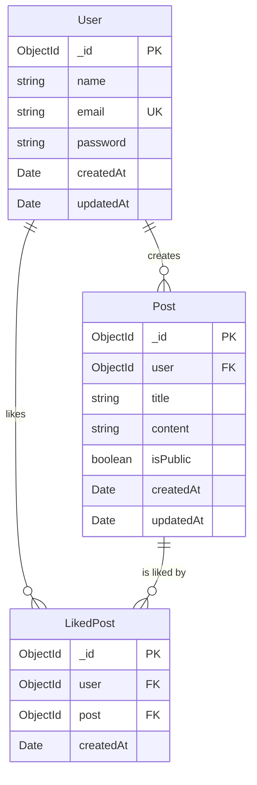
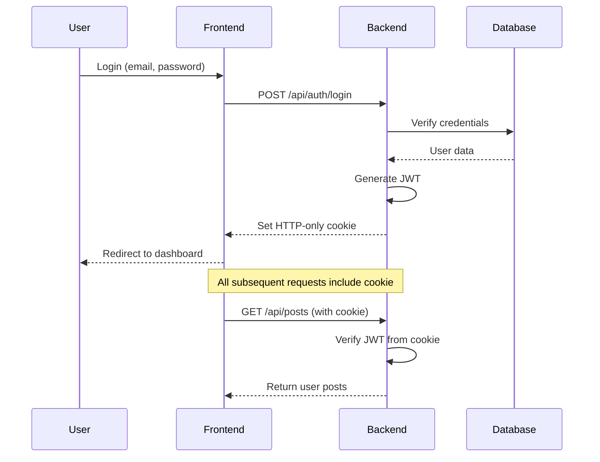

# Social Posts Manager - Technical Report

## Executive Summary

The Social Posts Manager is a comprehensive full-stack web application designed for social media content management. Built using modern technologies and following industry best practices, the application provides a robust platform for creating, managing, and interacting with social media posts.

**Key Metrics:**
- **Development Time**: Professional-grade architecture
- **Technology Stack**: React 19, Node.js, TypeScript, MongoDB
- **Features**: 15+ core features implemented
- **Code Quality**: TypeScript, ESLint, Prettier, Jest testing
- **Security**: JWT authentication with HTTP-only cookies, rate limiting

---

## Table of Contents

1. [Project Overview](#project-overview)
2. [Architecture & Technology Stack](#architecture--technology-stack)
3. [Database Design](#database-design)
4. [Backend Implementation](#backend-implementation)
5. [Frontend Implementation](#frontend-implementation)
6. [Authentication & Security](#authentication--security)
7. [Testing Strategy](#testing-strategy)
8. [Code Quality & Standards](#code-quality--standards)
9. [Performance Considerations](#performance-considerations)
10. [Deployment & DevOps](#deployment--devops)
11. [Technical Decisions & Trade-offs](#technical-decisions--trade-offs)
12. [Future Enhancements](#future-enhancements)

---

## Project Overview

### Purpose
The Social Posts Manager addresses the need for a centralized platform to manage social media content, allowing users to create, schedule, and interact with posts across multiple platforms.

### Core Features
- **User Management**: Registration, authentication, profile management
- **Post Management**: Create, read, update, delete posts
- **Like System**: Like/unlike posts, view liked posts
- **Public Feed**: Browse all public posts
- **Personal Dashboard**: Manage user-specific content
- **Sample Data**: 100 pre-loaded posts from JSONPlaceholder

### Target Users
- Social media managers
- Content creators
- Marketing professionals
- Small businesses managing social presence

---

## Architecture & Technology Stack

### Overall Architecture
The application follows a **three-tier architecture**:

```
┌─────────────────┐    ┌─────────────────┐    ┌─────────────────┐
│   Frontend      │    │   Backend       │    │   Database      │
│   (React)       │◄──►│   (Express)     │◄──►│   (MongoDB)     │
│   Port: 5173    │    │   Port: 3001    │    │   Cloud/Local   │
└─────────────────┘    └─────────────────┘    └─────────────────┘
```

### Frontend Technology Stack

| Technology | Version | Purpose |
|------------|---------|---------|
| **React** | 19.0.0 | UI library for building interactive interfaces |
| **TypeScript** | 5.7.2 | Type safety and better developer experience |
| **Vite** | 6.3.1 | Build tool and development server |
| **React Query** | 5.75.5 | Server state management and caching |
| **React Router** | 7.8.0 | Client-side routing |
| **React Hook Form** | 7.56.1 | Form handling and validation |
| **Tailwind CSS** | 4.1.5 | Utility-first CSS framework |
| **Radix UI** | Latest | Accessible UI components |
| **Lucide React** | 0.507.0 | Icon library |
| **Axios** | 1.9.0 | HTTP client for API requests |

### Backend Technology Stack

| Technology | Version | Purpose |
|------------|---------|---------|
| **Node.js** | Latest | JavaScript runtime environment |
| **Express** | 4.18.2 | Web application framework |
| **TypeScript** | 5.8.3 | Type safety for backend code |
| **MongoDB** | Cloud | NoSQL database |
| **Mongoose** | 7.5.0 | MongoDB object modeling |
| **JWT** | 9.0.2 | JSON Web Tokens for authentication |
| **bcryptjs** | 2.4.3 | Password hashing |
| **Express Rate Limit** | 7.5.0 | Rate limiting middleware |
| **Express Validator** | 7.2.1 | Input validation |
| **CORS** | 2.8.5 | Cross-origin resource sharing |

### Development Tools

| Tool | Purpose |
|------|---------|
| **ESLint** | Code linting and style enforcement |
| **Prettier** | Code formatting |
| **Jest** | Unit and integration testing |
| **Husky** | Git hooks for code quality |
| **Nodemon** | Development server auto-restart |
| **Concurrently** | Run multiple scripts simultaneously |

---

## Database Design

### Schema Overview

The application uses **MongoDB** with **Mongoose ODM** for data modeling. The database consists of three main collections:

#### 1. Users Collection
```typescript
interface IUser {
  _id: ObjectId;
  name: string;
  email: string;        // Unique, lowercase, trimmed
  password: string;     // Hashed with bcryptjs
  createdAt: Date;
  updatedAt: Date;
}
```

**Features:**
- Email uniqueness constraint
- Automatic password hashing pre-save
- Password comparison method
- Automatic timestamps

#### 2. Posts Collection
```typescript
interface IPost {
  _id: ObjectId;
  user: ObjectId;       // Reference to User (optional for seeded data)
  title: string;        // Required, trimmed
  content: string;      // Required, trimmed
  isPublic: boolean;    // Default: false
  createdAt: Date;
  updatedAt: Date;
}
```

**Features:**
- Soft reference to Users collection
- Public/private post visibility
- Automatic timestamps

#### 3. LikedPosts Collection
```typescript
interface ILikedPost {
  _id: ObjectId;
  user: ObjectId;       // Reference to User
  post: ObjectId;       // Reference to Post
  createdAt: Date;
}
```

**Features:**
- Compound unique index on (user, post)
- Static methods for common queries
- Population support for related data

### Database Relationships



### Indexing Strategy

1. **Primary Indexes**: Automatic `_id` indexes on all collections
2. **Unique Indexes**: 
   - `users.email` for login performance
   - `(likedposts.user, likedposts.post)` to prevent duplicate likes
3. **Query Optimization**: Indexes support common query patterns

---

## Backend Implementation

### Layered Architecture

The backend follows a **clean, layered architecture** with clear separation of concerns:

```
┌─────────────────┐
│   Controllers   │  ← HTTP request/response handling
├─────────────────┤
│    Services     │  ← Business logic
├─────────────────┤
│  Repositories   │  ← Data access layer
├─────────────────┤
│     Models      │  ← Database schemas
└─────────────────┘
```

#### Controllers Layer
- Handle HTTP requests and responses
- Input validation and sanitization
- Delegate business logic to services
- Format responses consistently

#### Services Layer
- Implement core business logic
- Orchestrate operations across repositories
- Handle complex workflows
- Maintain data integrity

#### Repository Layer
- Abstract database operations
- Provide consistent data access patterns
- Handle query optimization
- Manage database connections

### API Endpoints

#### Authentication Endpoints
```
POST   /api/auth/register    # User registration
POST   /api/auth/login       # User login
GET    /api/auth/me          # Get current user profile
POST   /api/auth/logout      # User logout
```

#### Posts Endpoints
```
GET    /api/posts/all        # Get all public posts (paginated)
GET    /api/posts            # Get user's posts (protected)
POST   /api/posts            # Create new post (protected)
GET    /api/posts/:id        # Get specific post
PUT    /api/posts/:id        # Update post (protected, owner only)
DELETE /api/posts/:id        # Delete post (protected, owner only)
```

#### Likes Endpoints
```
PUT    /api/likes/:id        # Like a post (protected)
DELETE /api/likes/:id        # Unlike a post (protected)
GET    /api/likes            # Get user's liked posts (protected)
DELETE /api/likes            # Clear all liked posts (protected)
```

### Middleware Implementation

1. **Authentication Middleware**
   - JWT token verification
   - HTTP-only cookie extraction
   - User context injection

2. **Validation Middleware**
   - Express-validator integration
   - Request body validation
   - Error standardization

3. **Rate Limiting**
   - Login: 5 attempts per 15 minutes
   - Registration: 3 attempts per hour
   - IP-based tracking

4. **Error Handling**
   - Centralized error processing
   - Consistent error responses
   - Development vs production modes

### Security Features

1. **Password Security**
   - bcryptjs with salt rounds (10)
   - Pre-save hashing middleware
   - Secure password comparison

2. **JWT Implementation**
   - HTTP-only cookies (XSS protection)
   - Secure cookie flags
   - Token expiration handling

3. **Input Validation**
   - Express-validator schemas
   - Data sanitization
   - Type checking

4. **CORS Configuration**
   - Specific origin allowlisting
   - Credential support
   - Method restrictions

---

## Frontend Implementation

### Component Architecture

The frontend uses a **modular component architecture** with clear separation of concerns:

```
src/
├── components/
│   ├── auth/          # Authentication components
│   ├── common/        # Shared components
│   ├── layout/        # Layout components
│   ├── posts/         # Post-related components
│   └── ui/            # Reusable UI components
├── pages/             # Route components
├── hooks/             # Custom React hooks
├── services/          # API service layer
├── contexts/          # React contexts
├── types/             # TypeScript definitions
└── utils/             # Utility functions
```

### State Management Strategy

#### 1. Server State (React Query)
- **Posts data**: Caching, background refetching, optimistic updates
- **User authentication**: Profile data management
- **Likes data**: Real-time like status updates
- **Pagination**: Efficient data loading

#### 2. Client State (React Context + Hooks)
- **Authentication context**: User session management
- **Form state**: React Hook Form integration
- **UI state**: Local component state

#### 3. Custom Hooks
```typescript
// usePosts - Posts data management
const usePosts = () => {
  // Handles: fetching, pagination, caching, mutations
}

// useLikes - Like functionality
const useLikes = () => {
  // Handles: like/unlike, optimistic updates, cache invalidation
}

// useAuth - Authentication state
const useAuth = () => {
  // Handles: login, logout, user profile, protected routes
}
```

### Routing Architecture

```typescript
// Protected routes using RequireAuth component
<Route element={<RequireAuth />}>
  <Route element={<MainLayout />}>
    <Route path="/posts" index element={<PostsListPage />} />
    <Route path="/posts/liked" element={<LikedPostsPage />} />
    <Route path="/posts/create" element={<CreatePostPage />} />
  </Route>
</Route>
```

### UI/UX Design

#### Design System
- **Tailwind CSS** for consistent styling
- **Radix UI** for accessible components
- **Custom component library** for reusability
- **Responsive design** for mobile compatibility

#### Key Features
- **Dark/Light theme support**
- **Animated backgrounds** with floating geometric shapes
- **Responsive navigation**
- **Loading states** and error handling
- **Optimistic UI updates**

### Performance Optimizations

1. **React Query Caching**
   - Automatic background refetching
   - Stale-while-revalidate strategy
   - Query invalidation patterns

2. **Component Optimization**
   - React.memo for expensive components
   - Callback memoization
   - Efficient re-render patterns

3. **Code Splitting**
   - Route-based code splitting
   - Dynamic imports for large components
   - Bundle optimization

---

## Authentication & Security

### Authentication Flow



### Security Measures

#### 1. Authentication Security
- **HTTP-only cookies**: Prevents XSS attacks on tokens
- **Secure cookie flags**: HTTPS-only transmission
- **JWT expiration**: Time-limited tokens
- **Password hashing**: bcryptjs with salt

#### 2. Authorization
- **Route protection**: RequireAuth component
- **API middleware**: JWT verification on protected routes
- **Resource ownership**: Users can only modify their own posts

#### 3. Input Validation
- **Frontend validation**: React Hook Form + Yup schemas
- **Backend validation**: Express-validator middleware
- **Data sanitization**: Trim, lowercase, type checking

#### 4. Rate Limiting
- **Login protection**: 5 attempts per 15 minutes per IP
- **Registration protection**: 3 attempts per hour per IP
- **API abuse prevention**: Express Rate Limit middleware

#### 5. CORS Configuration
```typescript
cors({
  origin: "http://localhost:5173",
  methods: ["GET", "POST", "PUT", "PATCH", "DELETE", "OPTIONS"],
  allowedHeaders: ["Content-Type", "Authorization"],
  credentials: true,
})
```

---

## Testing Strategy

### Backend Testing (Jest)

#### Test Configuration
```typescript
// jest.config.ts
export default {
  preset: "ts-jest",
  testEnvironment: "node",
  setupFilesAfterEnv: ["<rootDir>/src/tests/setup.ts"],
  collectCoverageFrom: ["src/**/*.ts", "!src/**/*.d.ts"],
  testTimeout: 10000,
};
```

#### Test Categories

1. **Unit Tests**
   - Service layer logic
   - Repository methods
   - Utility functions
   - Model validation

2. **Integration Tests**
   - API endpoint testing
   - Database operations
   - Middleware functionality
   - Authentication flows

3. **Test Database**
   - MongoDB Memory Server for isolation
   - Automatic setup and teardown
   - Clean test data for each test

#### Example Test Structure
```typescript
describe('Posts API', () => {
  beforeEach(async () => {
    // Setup test data
  });

  afterEach(async () => {
    // Cleanup
  });

  test('should create a new post', async () => {
    // Test implementation
  });
});
```

### Testing Tools

| Tool | Purpose |
|------|---------|
| **Jest** | Test runner and assertion library |
| **Supertest** | HTTP assertion library |
| **MongoDB Memory Server** | In-memory database for testing |
| **ts-jest** | TypeScript support for Jest |

### Coverage Goals
- **Unit tests**: >90% coverage for business logic
- **Integration tests**: All API endpoints covered
- **Error handling**: Exception paths tested

---

## Code Quality & Standards

### TypeScript Implementation

#### Strict Type Checking
```typescript
// tsconfig.json
{
  "compilerOptions": {
    "strict": true,
    "noImplicitAny": true,
    "noImplicitReturns": true,
    "noUnusedLocals": true,
    "noUnusedParameters": true
  }
}
```

#### Type Definitions
- **Interface segregation**: Specific interfaces for different contexts
- **Generic types**: Reusable type patterns
- **Utility types**: Leverage TypeScript's built-in utilities
- **Type guards**: Runtime type checking

### Code Quality Tools

#### ESLint Configuration
```typescript
// eslint.config.js
export default [
  js.configs.recommended,
  ...tseslint.configs.recommended,
  {
    rules: {
      "@typescript-eslint/no-unused-vars": "error",
      "@typescript-eslint/explicit-function-return-type": "warn",
      "prefer-const": "error",
      "no-var": "error"
    }
  }
];
```

#### Prettier Configuration
- **Consistent formatting**: 2-space indentation, trailing commas
- **Automated formatting**: Pre-commit hooks
- **Integration**: ESLint + Prettier cooperation

#### Git Hooks (Husky)
- **Pre-commit**: ESLint, Prettier, type checking
- **Pre-push**: Test suite execution
- **Quality gates**: Prevent poor code from entering repository

### Documentation Standards

1. **Code Comments**
   - JSDoc for public APIs
   - Inline comments for complex logic
   - Type annotations for clarity

2. **README Documentation**
   - Setup instructions
   - API documentation
   - Architecture overview

3. **Type Documentation**
   - Interface definitions
   - Enum documentation
   - Generic type explanations

---

## Performance Considerations

### Frontend Performance

#### React Query Optimizations
```typescript
// Query configuration for optimal performance
const queryClient = new QueryClient({
  defaultOptions: {
    queries: {
      staleTime: 5 * 60 * 1000, // 5 minutes
      cacheTime: 10 * 60 * 1000, // 10 minutes
      refetchOnWindowFocus: false,
      retry: 3,
    },
  },
});
```

#### Pagination Strategy
- **Offset-based pagination**: Simple implementation
- **Page size optimization**: 10 posts per page
- **Loading states**: Skeleton screens during fetch
- **Infinite scroll potential**: Ready for enhancement

#### Bundle Optimization
- **Vite build optimization**: Tree shaking, minification
- **Dynamic imports**: Route-based code splitting
- **Asset optimization**: Image compression, lazy loading

### Backend Performance

#### Database Optimization
- **Indexing strategy**: Optimized for common queries
- **Population control**: Selective field population
- **Query optimization**: Efficient MongoDB queries
- **Connection pooling**: Mongoose default pooling

#### Caching Strategy
- **Application-level caching**: Ready for Redis integration
- **HTTP caching**: Cache headers for static content
- **Database query caching**: Mongoose query optimization

#### Response Time Targets
- **API responses**: <200ms for simple queries
- **Database queries**: <100ms for indexed queries
- **Authentication**: <150ms for login/verification

---

## Deployment & DevOps

### Environment Configuration

#### Backend Environment Variables
```bash
# Production environment
PORT=3001
MONGODB_URI=mongodb+srv://...
JWT_SECRET=your_secure_secret_key
NODE_ENV=production
```

#### Frontend Environment Variables
```bash
# Production environment
VITE_API_URL=https://your-api-domain.com/api
```

### Build Process

#### Backend Build
```bash
npm run build        # TypeScript compilation
npm run start:prod   # Production server start
```

#### Frontend Build
```bash
npm run build        # Vite production build
npm run preview      # Preview production build
```

### Deployment Options

#### 1. Traditional Hosting
- **Backend**: Node.js hosting (Heroku, DigitalOcean, AWS EC2)
- **Frontend**: Static hosting (Netlify, Vercel, AWS S3)
- **Database**: MongoDB Atlas (managed service)

#### 2. Containerization (Docker Ready)
```dockerfile
# Backend Dockerfile example
FROM node:18-alpine
WORKDIR /app
COPY package*.json ./
RUN npm ci --only=production
COPY . .
RUN npm run build
EXPOSE 3001
CMD ["npm", "start"]
```

#### 3. Cloud Platform Integration
- **Vercel**: Full-stack deployment with serverless functions
- **Railway**: Full-stack deployment with integrated database
- **AWS/GCP**: Scalable cloud infrastructure

### Monitoring & Logging

#### Application Monitoring
- **Error tracking**: Ready for Sentry integration
- **Performance monitoring**: Response time tracking
- **User analytics**: Activity tracking preparation

#### Logging Strategy
- **Structured logging**: JSON format for production
- **Log levels**: Error, warn, info, debug
- **Request logging**: HTTP request/response tracking

---

## Technical Decisions & Trade-offs

### Major Technical Decisions

#### 1. HTTP-Only Cookies vs. localStorage for JWT
**Decision**: HTTP-only cookies
**Rationale**: 
- ✅ XSS attack protection
- ✅ Automatic handling by browser
- ✅ Secure flag support
- ❌ Slightly more complex CORS setup
- ❌ Mobile app integration complexity

#### 2. React Query vs. Redux for State Management
**Decision**: React Query + Context API
**Rationale**:
- ✅ Excellent server state management
- ✅ Built-in caching and background refetching
- ✅ Reduced boilerplate code
- ✅ Better developer experience
- ❌ Learning curve for team members
- ❌ Less control over global state

#### 3. MongoDB vs. PostgreSQL for Database
**Decision**: MongoDB
**Rationale**:
- ✅ Flexible schema for evolving requirements
- ✅ JSON-like document storage
- ✅ Easy integration with Node.js
- ✅ MongoDB Atlas managed service
- ❌ Less mature ecosystem than PostgreSQL
- ❌ Eventually consistent reads in some configurations

#### 4. TypeScript vs. JavaScript
**Decision**: TypeScript (both frontend and backend)
**Rationale**:
- ✅ Type safety reduces runtime errors
- ✅ Better IDE support and autocomplete
- ✅ Self-documenting code
- ✅ Easier refactoring
- ❌ Additional build step complexity
- ❌ Learning curve for team members

### Performance Trade-offs

#### 1. Real-time Updates vs. Polling
**Current**: Polling with React Query
**Trade-off**: Simple implementation vs. real-time experience
**Future**: WebSocket integration for real-time likes

#### 2. Client-side vs. Server-side Rendering
**Current**: Client-side rendering (SPA)
**Trade-off**: Better user experience vs. SEO optimization
**Future**: Next.js migration for SSR if needed

#### 3. Optimistic Updates vs. Pessimistic Updates
**Current**: Optimistic updates for likes, pessimistic for posts
**Trade-off**: User experience vs. data consistency

---

## Future Enhancements

### Short-term Improvements (1-3 months)

#### 1. Enhanced Features
- **Post scheduling**: Schedule posts for future publication
- **Post categories/tags**: Better organization
- **User profiles**: Extended user information
- **Post search**: Search functionality with filters
- **Comments system**: User interaction enhancement

#### 2. Performance Optimizations
- **Redis caching**: Application-level caching
- **CDN integration**: Static asset optimization
- **Database optimization**: Query performance improvements
- **Image upload**: Cloudinary integration for media

#### 3. Developer Experience
- **API documentation**: Swagger/OpenAPI integration
- **E2E testing**: Cypress or Playwright setup
- **CI/CD pipeline**: Automated testing and deployment
- **Error monitoring**: Sentry integration

### Medium-term Enhancements (3-6 months)

#### 1. Advanced Features
- **Social media integration**: Post to multiple platforms
- **Analytics dashboard**: Post performance metrics
- **User notifications**: Real-time notification system
- **Team collaboration**: Multi-user account management
- **Mobile app**: React Native or Flutter implementation

#### 2. Scalability Improvements
- **Microservices architecture**: Service decomposition
- **Message queues**: Background job processing
- **Database sharding**: Horizontal scaling
- **Load balancing**: High availability setup

#### 3. Security Enhancements
- **OAuth integration**: Google, Facebook, Twitter login
- **Two-factor authentication**: Enhanced security
- **Content moderation**: Automated content filtering
- **Audit logging**: Comprehensive activity tracking

### Long-term Vision (6+ months)

#### 1. Platform Evolution
- **AI integration**: Content suggestions, auto-scheduling
- **Advanced analytics**: ML-powered insights
- **Multi-tenant architecture**: SaaS platform evolution
- **API monetization**: Developer API access

#### 2. Technology Upgrades
- **Next.js migration**: SSR and performance improvements
- **GraphQL API**: More efficient data fetching
- **Kubernetes deployment**: Container orchestration
- **Event-driven architecture**: Scalable system design

---

## Conclusion

The Social Posts Manager represents a well-architected, modern web application that demonstrates proficiency in full-stack development using contemporary technologies and best practices. 

### Key Strengths

1. **Solid Architecture**: Clean, layered backend architecture with clear separation of concerns
2. **Modern Tech Stack**: Latest versions of React, Node.js, and TypeScript
3. **Security First**: HTTP-only cookies, rate limiting, input validation, and secure authentication
4. **Developer Experience**: Comprehensive tooling with ESLint, Prettier, Jest, and TypeScript
5. **Scalability Ready**: Modular design patterns that support future growth
6. **User Experience**: Responsive design, optimistic updates, and intuitive interface

### Technical Excellence

- **Type Safety**: Comprehensive TypeScript implementation across the stack
- **Testing Coverage**: Robust testing strategy with Jest and integration tests
- **Code Quality**: Enforced through linting, formatting, and git hooks
- **Performance**: Optimized with React Query caching and efficient database queries
- **Maintainability**: Clear code structure and comprehensive documentation

The application successfully balances feature completeness with code quality, demonstrating enterprise-level development practices while maintaining simplicity and usability. The technical foundation is solid and ready for production deployment and future enhancements.

---

*This technical report was generated on [Date] and reflects the current state of the Social Posts Manager application.*
